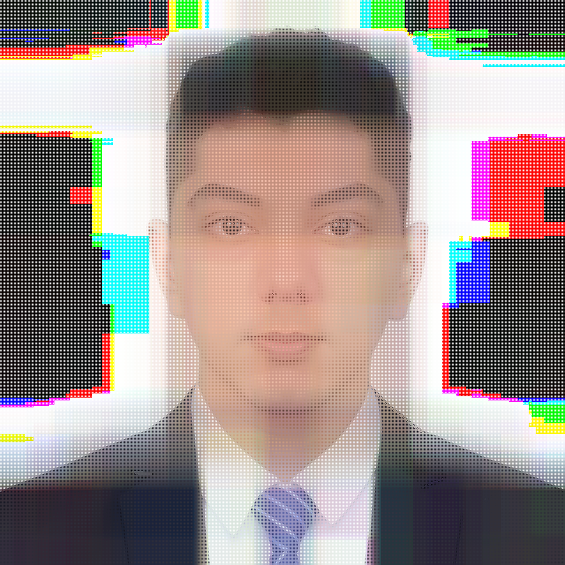
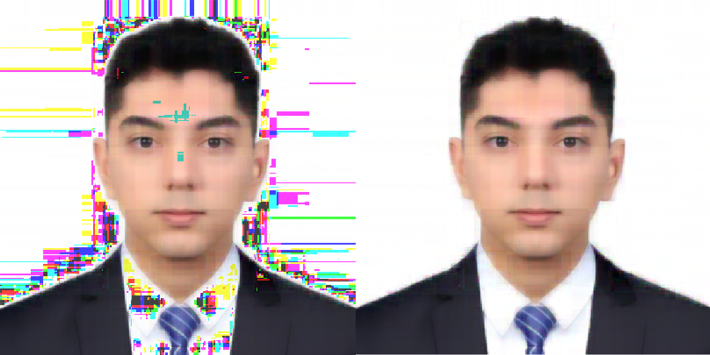

## Overview

This experimental work presents a different approach to increase the size and quality of an image by adding a blank pixel around each pixel in an image, enlarging the image, breaking it into parts, and generating these blank pixels by predicting them with machine learning models. The process uses imputation and regression methods to fill in missing pixel values, allowing for both image enlargement and enhancement.

## Key Components

- **Libraries Used**:
  - `numpy` for numerical computations.
  - `cv2` (OpenCV) for image processing tasks.
  - `xgboost` for implementing the regression models.

- **Input and Output**:
  - **Input Image**: `Tinput.bmp` located at `C:\ImageAdjuster\`.
  - **Output Image**: `Toutput.bmp` saved in the same directory.

## Workflow

1. **Image Loading**:
   - The script reads the input image using `cv2.imread` with color mode.
   - Retrieves the dimensions (rows, columns, channels) of the original image.

2. **Image Expansion**:
   - The process begins by enlarging the original image size by adding blank pixels around each existing pixel.
   - The new dimensions are calculated as `new_rows = 2 * rows - 1` and `new_cols = 2 * cols - 1`.
   - The empty image array (`new_image`) is created with these dimensions, where the original pixels are placed at positions `(2 * row, 2 * col)`.

3. **Regression Model Setup**:
   - XGBoost regression parameters are defined, including `max_depth`, `learning_rate`, and `n_estimators`.
   - A function `train_and_predict` is created to train the model using neighboring pixel values and predict the missing ones.

4. **Pixel Imputation**:
   - The script iterates over each pixel in the original image and predicts the values of the empty pixels around it.
   - **Horizontal Empty Pixels (Space to the Right)**:
     - The model predicts horizontal gaps (empty pixels on the right) by using the pixel values to the left and right of the gap as features.
     - For each channel (RGB), a set of training data (`X_train`) is prepared, consisting of the pixel values on either side of the gap. The model is then trained to predict the value of the pixel that would fill the gap.

   - **Vertical Empty Pixels (Space Below)**:
     - For vertical gaps (empty pixels below), the model predicts missing pixel values using the pixel values above and below the gap.
     - Similar to horizontal predictions, the training data is created by taking pixel values from the top and bottom, and the regression model predicts the missing vertical pixel for each color channel.

   - **Diagonal Empty Pixels (Right-Bottom Corner)**:
     - The diagonal empty pixels are predicted by considering the pixels in a 2x2 grid around the gap (top-left, top-right, bottom-left, and bottom-right).
     - A more complex regression model is trained using all four neighboring pixels to estimate the value of the diagonal empty pixel.

5. **Image Saving**:
   - Once all the missing pixels are predicted and filled, the enhanced and enlarged image is saved to the output path using `cv2.imwrite`.
   - A confirmation message is printed upon successful completion.

## How It Works

### Horizontal Empty Pixels
- The script estimates the missing horizontal pixels (those to the right of existing ones) by using two adjacent pixel values (one from the left and one from the right) as input features for the regression model.
- For instance, if pixel A is at (x, y) and pixel B is at (x, y+1), the blank pixel in between them is predicted based on A and B’s values.

### Vertical Empty Pixels
- Similar to the horizontal case, the missing vertical pixels (those below existing pixels) are predicted based on the pixel values immediately above and below the gap.
- This helps fill the gaps created by enlarging the image vertically.

### Diagonal Empty Pixels
- For the more complex diagonal gaps (those at the bottom-right corner of an existing pixel), the model uses the pixel values from a 2x2 surrounding region (top-left, top-right, bottom-left, bottom-right) to estimate the value of the missing pixel.
- This process ensures that diagonal relationships and patterns in the image are maintained and predicted with higher accuracy.

## Considerations

- **Performance**:
  - Training individual models for each missing pixel may be computationally intensive, particularly for larger images.
  - This method is suited for small images or as a conceptual exploration.

- **Optimization**:
  - Generalization of models or batch training could improve the efficiency of the pixel prediction process.
  - Other imputation or regression methods may provide faster results while maintaining quality.

- **Quality**:
  - The quality of the output image depends on the precision of the regression models used. More sophisticated models or larger feature sets could improve results, particularly for highly detailed images.

## Results

Here are some visual results obtained from applying different regression models for image enlargement and pixel imputation. These images demonstrate the effect of various models on the quality of the enlarged image.

### 2x Size with Spacing Technique

This is the result after simply enlarging the image with spacing for missing pixels before regression methods are applied.

### GradientBoostingRegressor

In this version, a Gradient Boosting Regressor is used to fill in the missing pixels, demonstrating its performance in terms of pixel prediction.

### KNN (K-Nearest Neighbors)

Using K-Nearest Neighbors (KNN) for pixel imputation yields this result, showing how KNN can infer pixel values based on local neighborhood information.

### RandomForest

RandomForest Regression is applied here to predict missing pixel values, providing a balance between performance and accuracy.

### XGBoost

Finally, the XGBoost model is used to predict the missing pixels, showcasing its capability in regression tasks for image enlargement.

## Conclusion

This script presents an innovative and experimental approach to image enlargement by combining imputation and regression techniques. By predicting missing pixel values using machine learning models trained on neighboring pixels, it offers a unique solution to image enhancement. This method demonstrates the potential of applying regression and imputation strategies in image processing, making it a valuable concept for further exploration.
